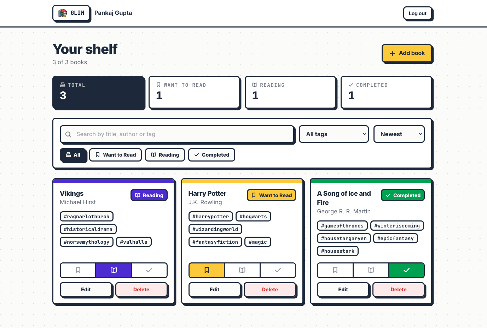
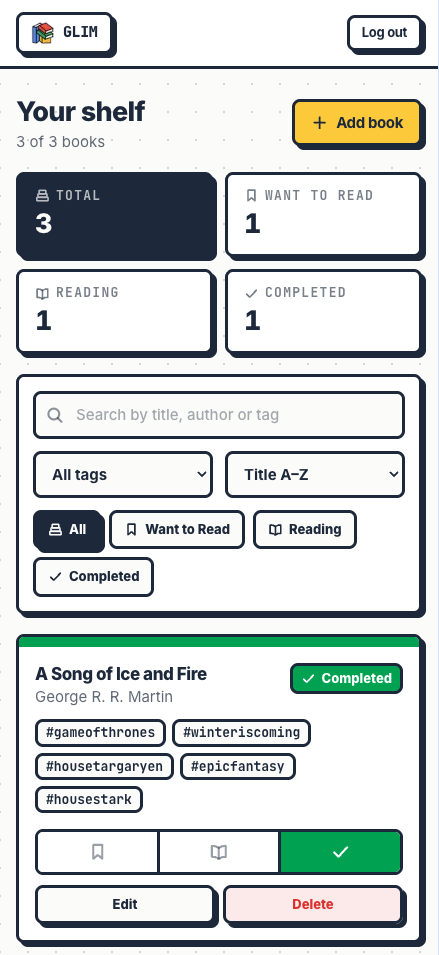

<p align="center">
  
</p>

<h1 align="center">Glim</h1>

<p align="center">Personal Book Manager</p>

A personal reading tracker built with Next.js, MongoDB and JWT auth. Sign up, log
the books you want to read, mark what you are reading, and keep a record of what
you finished.

## Screenshots

### Home

<p align="center">
  
</p>

### Dashboard

<table>
  <tr>
    <td width="70%" valign="top">
      
      <p align="center"><sub><b>Desktop</b></sub></p>
    </td>
    <td width="30%" valign="top">
      
      <p align="center"><sub><b>Mobile</b></sub></p>
    </td>
  </tr>
</table>

## Features

- **Authentication** — email + password sign up, log in, log out. JWT stored in an
  `httpOnly` cookie, never exposed to client-side JavaScript.
- **Route protection** — `proxy.ts` guards `/dashboard` and bounces logged-in
  users away from `/login` and `/signup`.
- **Book collection** — add, edit and delete books with title, author, tags and
  reading status.
- **Reading status** — Want to Read, Reading, Completed, switchable inline from
  the card without opening a form.
- **Filter, search, sort** — filter by status or tag, search across title,
  author and tags, sort by recently added, title or author.
- **Dashboard** — total books plus a live count per reading status.
- **Data isolation** — every query is scoped to the signed-in user, so one
  account can never read or mutate another account's books.

## Tech Stack

| Layer    | Choice                                    |
| -------- | ----------------------------------------- |
| Frontend | Next.js 16 (App Router), React 19          |
| Styling  | Tailwind CSS v4, neobrutalism design system |
| Backend  | Next.js Route Handlers                    |
| Database | MongoDB with Mongoose                     |
| Auth     | JWT (`jose`) + `bcryptjs`, httpOnly cookie |

## Getting Started

### 1. Install dependencies

```bash
npm install
```

### 2. Configure environment

Copy the example file and fill in your values:

```bash
cp .env.example .env
```

| Variable      | Description                                        |
| ------------- | -------------------------------------------------- |
| `MONGODB_URI` | MongoDB connection string (Atlas or local)          |
| `MONGODB_DB`  | Database name, defaults to `book_manager`           |
| `JWT_SECRET`  | Secret used to sign tokens                          |

Generate a secret with:

```bash
openssl rand -base64 48
```

### 3. Run

```bash
npm run dev
```

Open [http://localhost:3000](http://localhost:3000).

## Scripts

| Command         | Description                       |
| --------------- | --------------------------------- |
| `npm run dev`   | Start the development server      |
| `npm run build` | Create a production build         |
| `npm start`     | Serve the production build        |
| `npm run lint`  | Run ESLint                        |

## Project Structure

```
app/
  (auth)/            Login and signup pages
  api/auth/          Signup, login, logout, session routes
  api/books/         Book CRUD routes
  dashboard/         Protected shelf page
  page.tsx           Landing page
components/
  dashboard/         Shelf, cards, filters, modals
  ui/                Button, form fields, modal primitives
  AuthForm.tsx       Shared login and signup form
  icons.tsx          Custom stroke icon set
  Logo.tsx           Glim wordmark lockup
  Navbar.tsx         Dashboard header
lib/
  auth.ts            Password hashing, JWT sign and verify
  session.ts         Cookie-based session helpers
  db.ts              Cached Mongoose connection
  validation.ts      Request payload validation
  status.ts          Reading status metadata
models/
  User.ts            User schema
  Book.ts            Book schema
public/
  glim-logo.png      Full resolution logo
  glim-mark.png      Optimised mark used in the UI
  *.png              README screenshots
proxy.ts             Route protection
```

Favicon and touch icon are generated from the logo and live at `app/favicon.ico`,
`app/icon.png` and `app/apple-icon.png`, picked up automatically by Next.js.

## API

All book routes require a valid session cookie and operate only on the
authenticated user's own data.

| Method   | Endpoint           | Description                    |
| -------- | ------------------ | ------------------------------ |
| `POST`   | `/api/auth/signup` | Create an account and sign in  |
| `POST`   | `/api/auth/login`  | Sign in                        |
| `POST`   | `/api/auth/logout` | Clear the session cookie       |
| `GET`    | `/api/auth/me`     | Current user                   |
| `GET`    | `/api/books`       | List the user's books          |
| `POST`   | `/api/books`       | Create a book                  |
| `PATCH`  | `/api/books/:id`   | Update a book                  |
| `DELETE` | `/api/books/:id`   | Delete a book                  |

### Book shape

```json
{
  "id": "6a6e024f027dba9fea7d8039",
  "title": "The Pragmatic Programmer",
  "author": "Andrew Hunt",
  "tags": ["craft", "engineering"],
  "status": "reading",
  "createdAt": "2026-08-01T14:27:27.096Z",
  "updatedAt": "2026-08-01T14:27:27.096Z"
}
```

`status` is one of `want-to-read`, `reading`, `completed`.

## Design

The interface follows a neobrutalism system that echoes the Glim logo: warm
off-white surface, 3px black borders, hard offset shadows, and a small palette of
vivid accents mapped to meaning.

| Token     | Value     | Used for                     |
| --------- | --------- | ---------------------------- |
| Primary   | `#FDC800` | Want to Read, primary actions |
| Secondary | `#432DD7` | Reading, focus rings          |
| Success   | `#16A34A` | Completed                    |
| Danger    | `#DC2626` | Destructive actions, errors  |
| Surface   | `#FBFBF9` | Page background              |
| Ink       | `#1C293C` | Text and borders             |

Icons are a custom stroke set drawn to match the logo — no icon library, no
emoji. Every interactive element has explicit hover, focus-visible, active and
disabled states. Modals trap focus, close on `Escape`, and all motion is disabled
when `prefers-reduced-motion` is set.

## Deployment

1. Push the repository to GitHub.
2. Import it on Vercel.
3. Add `MONGODB_URI`, `MONGODB_DB` and `JWT_SECRET` as environment variables.
4. Allow Vercel's IPs in MongoDB Atlas Network Access.
